# FleetFlow ERP — Module Reference & Verification Guide

_What each module does, what was built, and how to check it — across all six delivery phases._

FleetFlow is an ERP for cross-border road freight across East & Central Africa. For every module below you get three things: **what it does**, **what was implemented**, and **how to verify** it — written for anyone, not only engineers. Each module includes a screenshot of the real screen, captured from a running, seeded copy of the system.

> **Companion documents:** [PRD-STATUS.md](PRD-STATUS.md) maps these modules to the contracted PRD scope; [README](../README.md) covers setup and architecture.

## Before you begin

**Open the system** (see the [README](../README.md) for full setup):

```bash
cd backend  && npm run dev     # API   → http://localhost:4000
cd frontend && npm run dev     # Web   → http://localhost:3000
# then sign in at http://localhost:3000/login
```

**Seeded sign-in accounts:**

| Role | Email | Password |
|------|-------|----------|
| Admin | `admin@fleetflow.local` | `admin1234` |
| Dispatcher | `dispatcher@fleetflow.local` | `dispatch1234` |
| Finance | `finance@fleetflow.local` | `finance1234` |
| Driver | `driver@fleetflow.local` | `driver1234` |
| Staff | `staff@fleetflow.local` | `staff1234` |

Use **Admin** for the full walkthrough. Prefer to explore safely? Provision an isolated **Demo Sandbox** (Phase 6) and reset it any time.

> ⚠️ Items marked **“Expected gap”** connect to an outside service (mobile money, e-invoicing, live GPS, bank feeds, biometric terminals) and are awaiting the client's credentials. They are built to receive the connection but are not live yet — please don't record them as defects. See [Expected gaps](#expected-gaps--not-defects) at the end.

## Contents

- [Phase 1 — Foundation](#phase-1--foundation)
- [Phase 2 — Core Finance](#phase-2--core-finance)
- [Phase 3 — Operations](#phase-3--operations)
- [Phase 4 — Inventory & Payroll](#phase-4--inventory--payroll)
- [Phase 5 — Assets & HR](#phase-5--assets--hr)
- [Phase 6 — Commercial & Dashboard](#phase-6--commercial--dashboard)
- [Cross-cutting controls](#cross-cutting-controls)
- [Expected gaps — not defects](#expected-gaps--not-defects)

---

## Phase 1 — Foundation

_The bedrock everything else stands on: signing in, keeping companies separate, the accounting ledger, basic supplier & customer money, and the audit trail._

### Access Control & Roles  <sub>`RBAC`</sub>

**What it does.** Everyone signs in with their own account, and each person only sees the screens and buttons their **role** allows.

**What was implemented**

- Secure sign-in (encrypted passwords, session tokens)
- Five built-in roles: **Admin, Dispatcher, Finance, Driver, Staff**
- Permissions are checked in the menus **and again** on every server request
- Drivers are locked to their own portal — they only see their own jobs

**How to verify**

1. Sign in as **Admin** and note the full menu, then sign out.
2. Sign in as **Driver** — you land in a driver-only view.
3. Confirm the Driver cannot open any admin screen.

> ✅ **Expected:** The available menu and actions change depending on who is signed in.

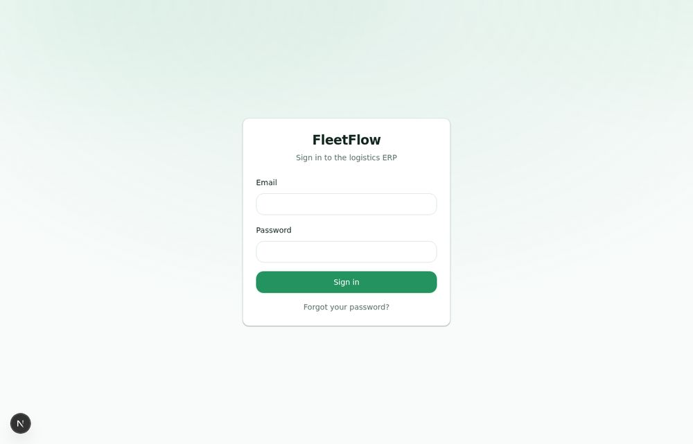

<sub>Screen: **Sign-in page**</sub>

### Organization & Multiple Companies  <sub>`M34`</sub>

**What it does.** One installation can run several legal entities at once, keeping each company's data completely separate.

**What was implemented**

- A registry of companies (each is a legal entity)
- Every record is tagged to its company and isolated behind the scenes
- A company switcher in the top bar; new records are created under the chosen company
- A separate fiscal calendar per company

**How to verify**

1. Open **System ▸ Companies** to see the registered entities.
2. Use the top-right **company switcher** to focus on one company.
3. Confirm the data on other screens now belongs only to that company.

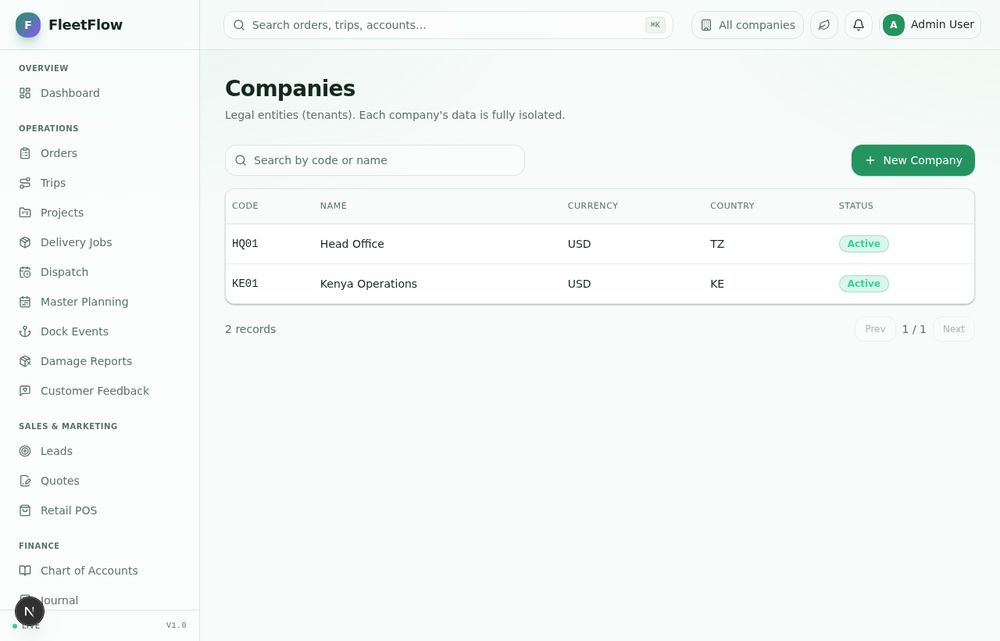

<sub>Screen: **System ▸ Companies**</sub>

### Chart of Accounts  <sub>`M8`</sub>

**What it does.** The master list of financial accounts (cash, receivables, revenue, expenses…) that every transaction is recorded against.

**What was implemented**

- Accounts grouped by type: **Asset, Liability, Equity, Income, Expense**
- A separate chart per company
- Accounts can be switched active / inactive

**How to verify**

1. Open **Finance ▸ Chart of Accounts** and review the accounts.
2. Create a new account, choosing its type.
3. Confirm it appears in the list.

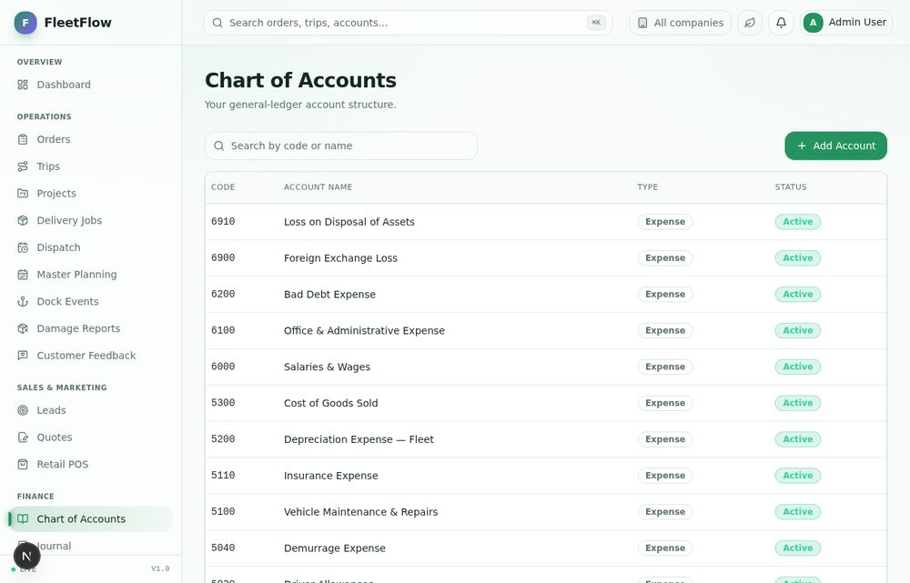

<sub>Screen: **Finance ▸ Chart of Accounts**</sub>

### General Ledger (Journal)  <sub>`M8`</sub>

**What it does.** The accounting backbone — every financial event is recorded as a balanced double-entry that cannot later be secretly changed.

**What was implemented**

- Balanced double-entry (debits must equal credits)
- Draft → Post → Reverse; a posted entry is **locked** and corrected only by a mirror-image reversal
- An exchange rate is stored on each posting (multi-currency)
- Refuses any posting dated in a closed month

**How to verify**

1. Open **Finance ▸ Journal** and post a **balanced** entry — it succeeds.
2. Try an **unbalanced** entry — it is rejected.
3. Reverse a posted entry — a contra entry is created and the original stays untouched.

> ✅ **Expected:** Balanced entries post; unbalanced ones are refused; posted entries are permanent.

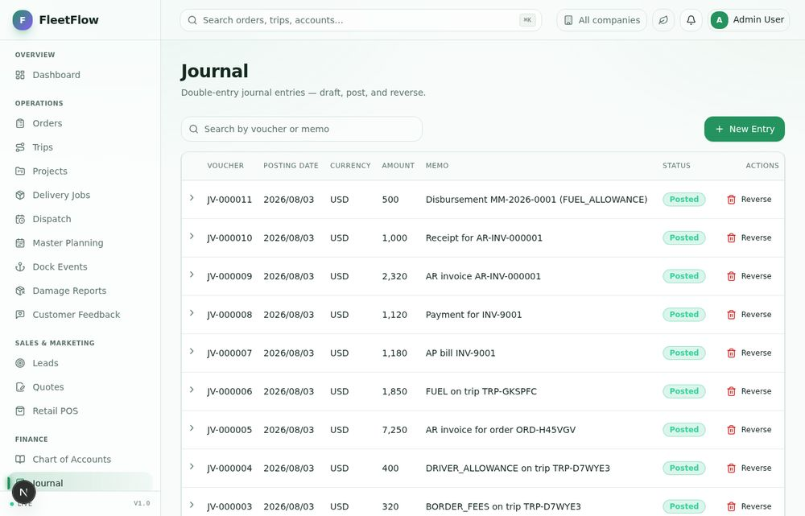

<sub>Screen: **Finance ▸ Journal**</sub>

### Accounts Payable (Suppliers)  <sub>`M1`</sub>

**What it does.** Tracks what the company owes its suppliers, from receiving a bill to paying it.

**What was implemented**

- Supplier master with tax IDs, payment terms and withholding tax
- Enter → post → pay bills, each step recorded in the ledger
- Three-way match with Procurement (Phase 4)

**How to verify**

1. Under **Vendors**, add a supplier.
2. Under **Payables**, enter a bill and post it.
3. Record a payment and confirm the balance clears.

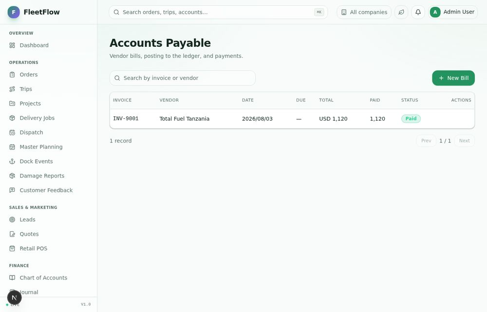

<sub>Screen: **Finance ▸ Vendors · Payables**</sub>

### Accounts Receivable (Customers)  <sub>`M2`</sub>

**What it does.** Tracks what customers owe the company, from raising an invoice to receiving the money.

**What was implemented**

- Customer registry with credit limit/days, tax-exempt flag and per-trip demurrage
- Raise → post → receipt invoices, each recorded in the ledger

**How to verify**

1. Under **Customers**, add a customer.
2. Under **Receivables**, raise an invoice and post it.
3. Record a receipt and confirm the balance clears.

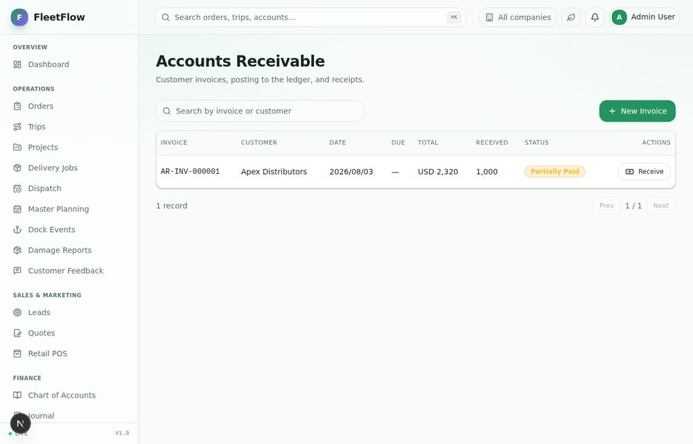

<sub>Screen: **Finance ▸ Customers · Receivables**</sub>

### User Management  <sub>`M36`</sub>

**What it does.** Create and manage the people who can use the system.

**What was implemented**

- Create users, set their role and home company
- Activate or deactivate accounts

**How to verify**

1. Open **System ▸ Users** and create a user with a role.
2. Confirm they can sign in with exactly that role's access.
3. Deactivate them and confirm they can no longer sign in.

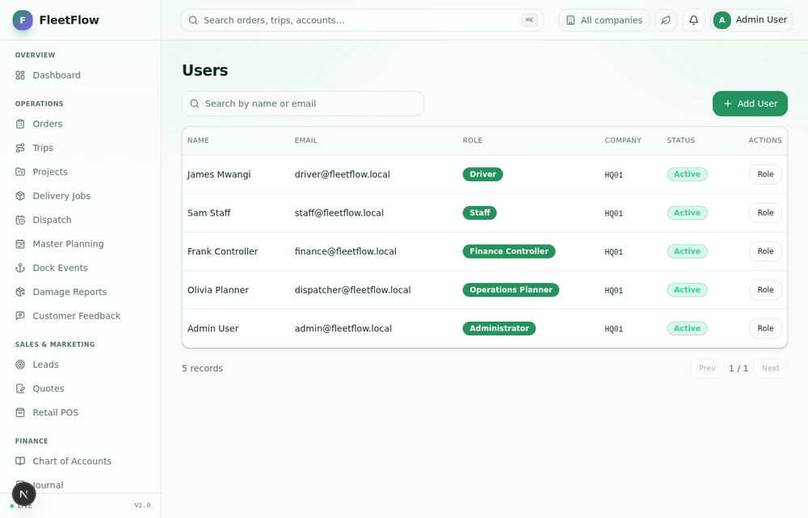

<sub>Screen: **System ▸ Users**</sub>

### Roles & Permissions  <sub>`M36`</sub>

**What it does.** Beyond the five built-in roles, an admin can design custom roles by ticking exactly which actions each is allowed.

**What was implemented**

- Custom roles with a permission matrix grouped by area
- Assign a custom role to a user; built-in roles are protected from deletion
- Changes take effect immediately — no technical redeploy

**How to verify**

1. Open **Roles & Permissions** and create a custom role.
2. Toggle some permissions on/off in the matrix.
3. Assign it to a user and confirm their access matches.

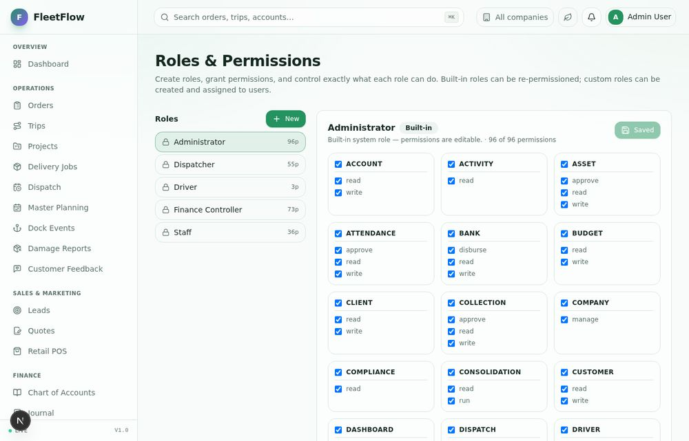

<sub>Screen: **System ▸ Roles & Permissions**</sub>

### Audit Log  <sub>`M31`</sub>

**What it does.** A dependable record of who changed what and when — including the exact values before and after.

**What was implemented**

- Every create / update / delete is logged
- On key records (clients, drivers, vehicles) it shows a **before → after** of the changed fields

**How to verify**

1. Edit a client, driver or vehicle.
2. Open **System ▸ Activity Log** and find the entry.
3. Confirm it shows the changed fields as before → after.

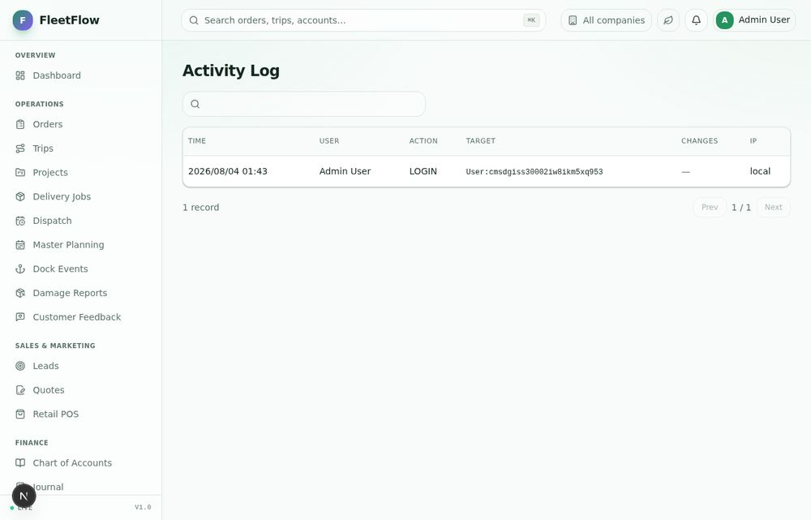

<sub>Screen: **System ▸ Activity Log**</sub>

---

## Phase 2 — Core Finance

_Financial control on top of the ledger: budgets, cash & bank, tax, currency revaluation, group consolidation, debt collection, and closing the books each month._

### Budgeting & Control  <sub>`M3`</sub>

**What it does.** Set spending limits per department and account, and have the system watch actual spend against them.

**What was implemented**

- Capital & operating budget lines per cost center
- Three control modes: **Strict block**, **Warning**, or **Override**
- Spend from trips and supplier bills is counted automatically

**How to verify**

1. Create a budget with lines and pick a control mode.
2. Record spending against a budgeted account.
3. Confirm the 'consumed' figure rises; Strict mode blocks going over.

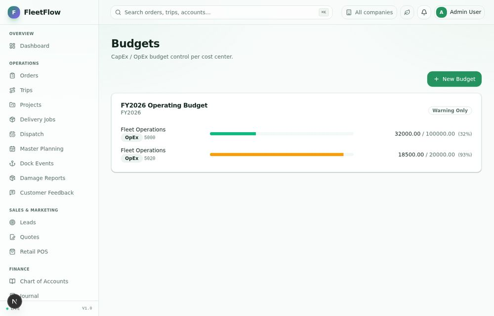

<sub>Screen: **Finance ▸ Budgets**</sub>

### Cash & Bank  <sub>`M4`</sub>

**What it does.** Manage cash, bank and mobile-money accounts, and pay drivers their advances.

**What was implemented**

- Bank, mobile-money and cash accounts
- Driver disbursements with a Pending → Success / Failed / Timeout lifecycle, recorded in the ledger when settled

**How to verify**

1. Add an account.
2. Issue a driver disbursement.
3. Confirm it moves through its lifecycle and posts to the ledger on success.

> ⚠️ **Expected gap:** Live M-Pesa / Airtel and bank-feed connections are not switched on yet — the lifecycle works, the external call is stubbed.

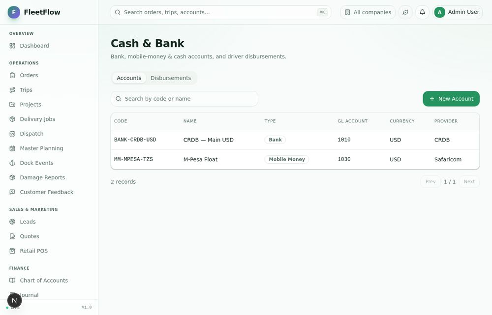

<sub>Screen: **Finance ▸ Cash & Bank**</sub>

### Tax — VAT & Withholding  <sub>`M10`</sub>

**What it does.** Prepare value-added-tax and withholding-tax returns for each country of operation.

**What was implemented**

- VAT / WHT return preparation
- Country tax tables for Tanzania, Kenya, Uganda, Rwanda and Zambia

**How to verify**

1. Open **Finance ▸ Tax**.
2. Prepare a return for a country and period.
3. Confirm the tax amounts are summarized correctly.

> ⚠️ **Expected gap:** Automatic electronic filing export is only partial.

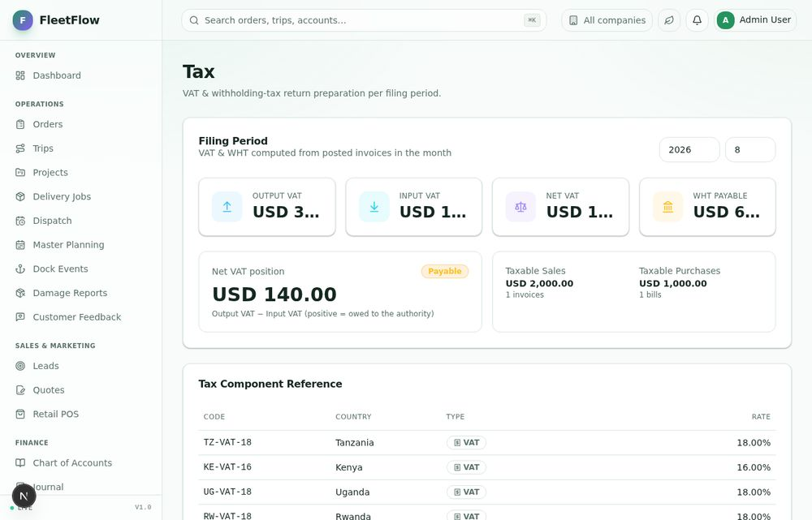

<sub>Screen: **Finance ▸ Tax**</sub>

### Exchange Rates & Revaluation  <sub>`M8`</sub>

**What it does.** Record currency rates and, at month-end, restate foreign-currency balances to today's rate — booking the resulting gain or loss.

**What was implemented**

- Rate entry by type (Spot / Average / Historical)
- Month-end revaluation you can **preview** then **post**; books the net unrealized FX gain or loss

**How to verify**

1. Enter exchange rates.
2. Run a period-end revaluation — preview, then post.
3. Confirm open foreign balances restate and the gain/loss posts.

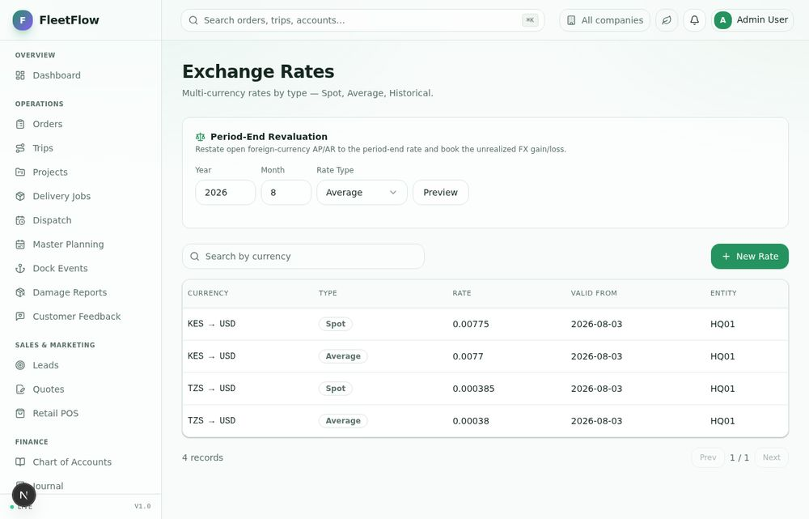

<sub>Screen: **Finance ▸ Exchange Rates**</sub>

### Consolidations  <sub>`M5`</sub>

**What it does.** Roll several subsidiaries' numbers up into a single parent-company view.

**What was implemented**

- Map subsidiary accounts to parent accounts
- Roll up by rate type and flag anything unmapped or missing a rate

**How to verify**

1. Map subsidiary accounts to parent accounts.
2. Run the rollup.
3. Confirm the parent view combines them and flags any gaps.

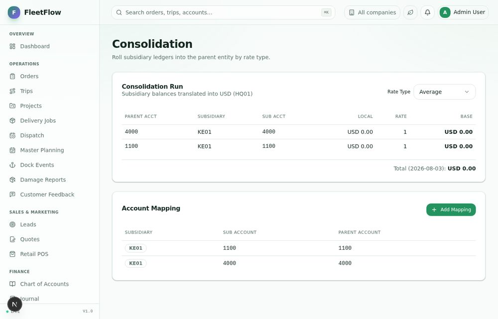

<sub>Screen: **Finance ▸ Consolidation**</sub>

### Credit & Collections  <sub>`M7`</sub>

**What it does.** Chase overdue customer invoices, manage disputes, and write off bad debt.

**What was implemented**

- Overdue 'aging' buckets and a reminder ladder (Reminder → … → Legal)
- Dispute lifecycle, promise-to-pay and a contact log
- Bad-debt write-off posts to the ledger automatically

**How to verify**

1. Review the aging buckets.
2. Log a reminder or a promise-to-pay.
3. Write off a bad debt and confirm the accounting entry.

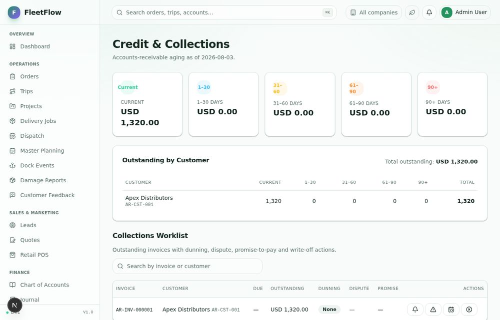

<sub>Screen: **Finance ▸ Collections**</sub>

### Accounting Periods (Month Close)  <sub>`M34`</sub>

**What it does.** Close a finished month so nobody can back-date entries into it.

**What was implemented**

- Open / close fiscal periods per company
- Once closed, the ledger refuses **any** posting dated in that month

**How to verify**

1. Close a month.
2. Try to post a journal dated inside it.
3. Confirm the system refuses it.

> ✅ **Expected:** A closed month is locked against all new postings.

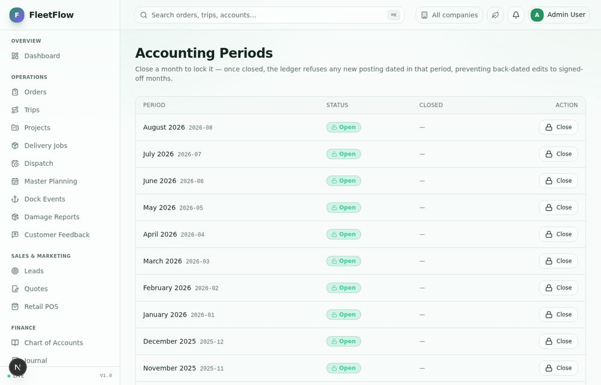

<sub>Screen: **Finance ▸ Accounting Periods**</sub>

---

## Phase 3 — Operations

_The logistics heart of the system: keeping the fleet legal, booking and running cross-border freight, dispatching domestic jobs, and the shared reference data._

### Vehicles & Maintenance  <sub>`M11`</sub>

**What it does.** The fleet register — every truck, its service history, and its document expiry dates.

**What was implemented**

- Vehicle registry and maintenance log
- Insurance / inspection / COMESA / Yellow Card expiry tracking

**How to verify**

1. Add a vehicle.
2. Record a maintenance event and set expiry dates.
3. Confirm the history and expiries are kept.

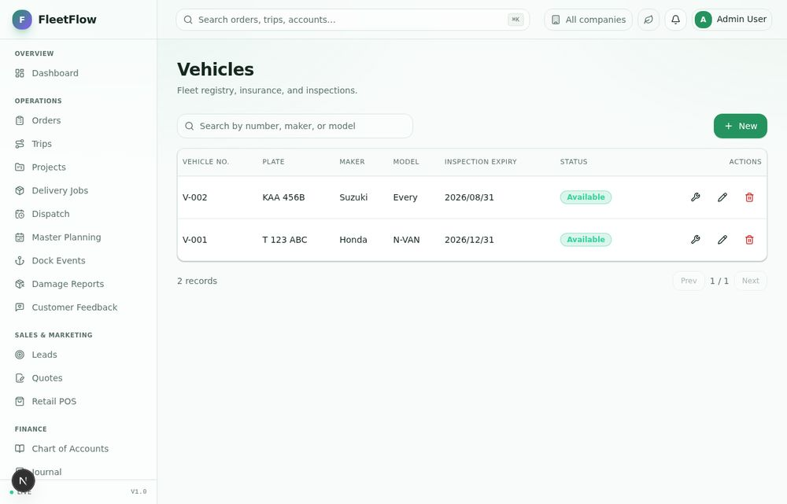

<sub>Screen: **Fleet & People ▸ Vehicles**</sub>

### Drivers & Documents  <sub>`M11`</sub>

**What it does.** The driver register — licences, travel documents, and who is available when.

**What was implemented**

- Driver registry with a document store (licence, passport, Yellow Fever, COMESA)
- Availability and holidays

**How to verify**

1. Add a driver.
2. Add documents and set availability.
3. Confirm the documents and expiry dates are recorded.

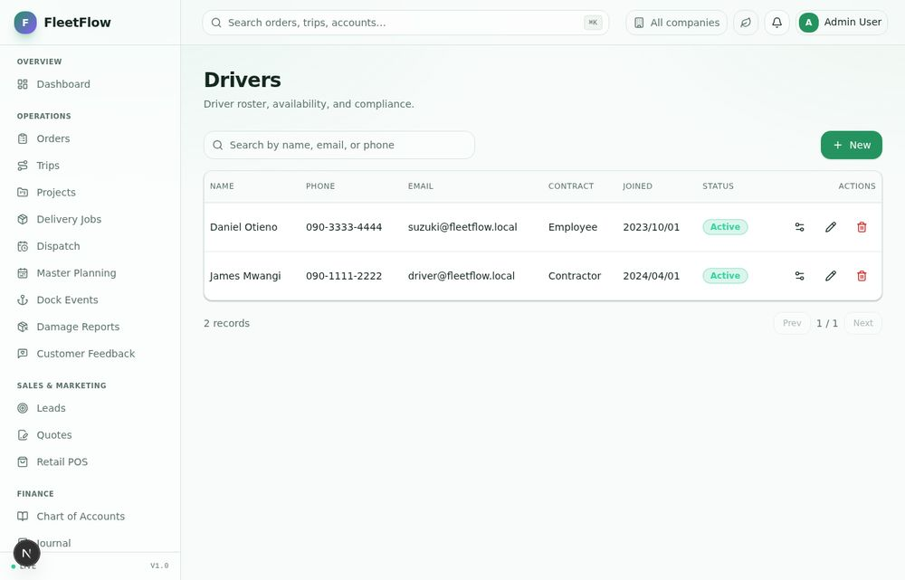

<sub>Screen: **Fleet & People ▸ Drivers**</sub>

### Compliance Dashboard  <sub>`M11`</sub>

**What it does.** One screen showing every expiring or expired document across the whole fleet, plus fuel efficiency against target.

**What was implemented**

- A single expiry dashboard with a 14-day early-warning window
- Fuel-efficiency monitoring per vehicle

**How to verify**

1. Open **Compliance**.
2. Confirm documents expiring within 14 days (and expired ones) are highlighted.
3. Confirm fuel efficiency is shown against its target.

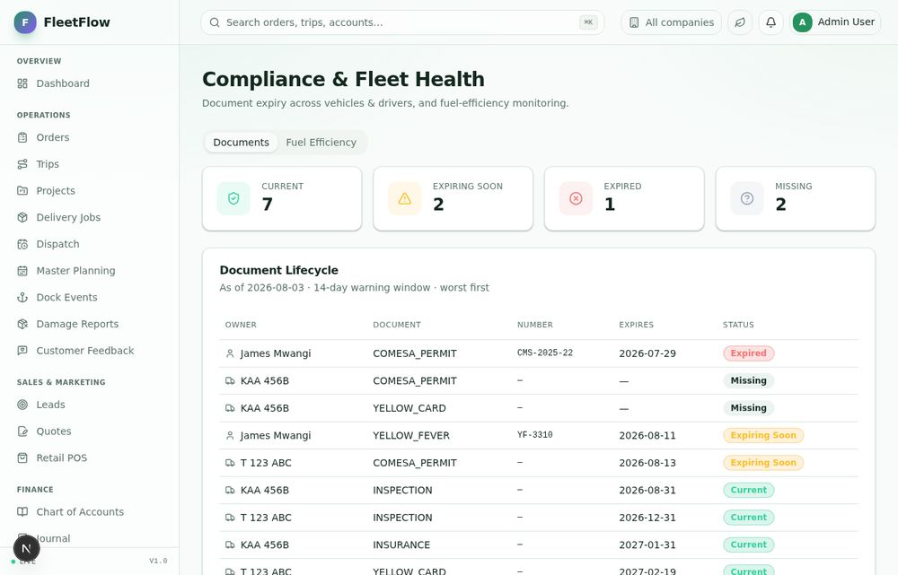

<sub>Screen: **Fleet & People ▸ Compliance**</sub>

### Orders (Freight Bookings)  <sub>`M12`</sub>

**What it does.** Cross-border freight bookings — where cargo goes, along which corridor, and for how much.

**What was implemented**

- Orders with corridor (Northern / Central / Domestic), weight/volume, freight + demurrage and currency
- Invoicing an order records the customer receivable automatically

**How to verify**

1. Create an order (corridor, weight, freight).
2. Click **Invoice**.
3. Confirm the receivable posts to the ledger.

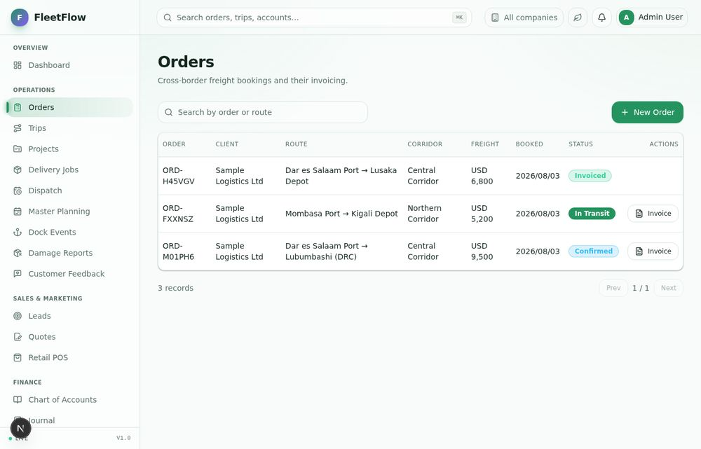

<sub>Screen: **Operations ▸ Orders**</sub>

### Trips & Trip Profit  <sub>`M12`</sub>

**What it does.** Running an order with a chosen driver and truck, recording the costs, and seeing the profit on that trip.

**What was implemented**

- Trip execution with route, mileage and expenses
- Automatic per-trip profit & loss
- Freight-bill reconciliation (Unreconciled / Matched / Discrepancy)

**How to verify**

1. Execute an order with a driver + vehicle and add expenses.
2. Open the **Trip P&L**.
3. Check the freight-bill reconciliation status.

> ⚠️ **Expected gap:** The live GPS position feed is not connected yet — positions are modeled, the feed is stubbed.

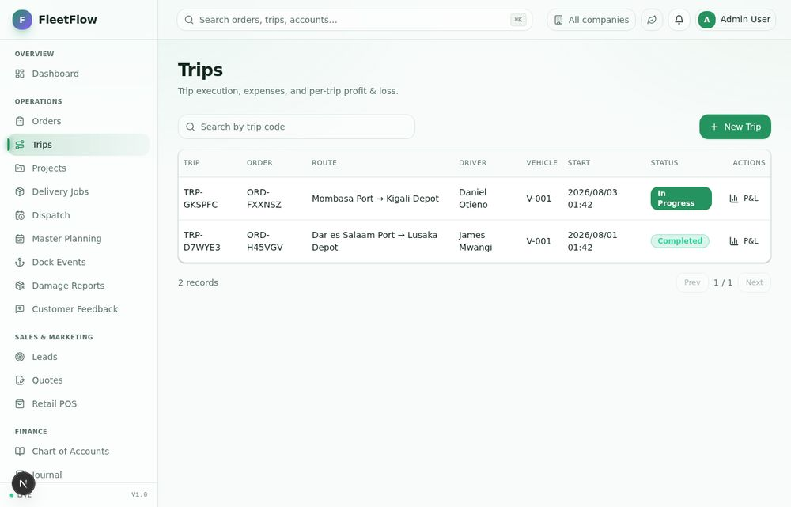

<sub>Screen: **Operations ▸ Trips**</sub>

### Dispatch & Delivery Jobs  <sub>`M12`</sub>

**What it does.** Domestic delivery jobs and assigning a free driver + truck without double-booking anyone.

**What was implemented**

- Delivery jobs list with search and status
- Dispatch with an automatic clash check; a printable dispatch sheet

**How to verify**

1. Create a delivery job.
2. Dispatch a free driver + vehicle.
3. Try to double-book the same driver — confirm it is blocked.

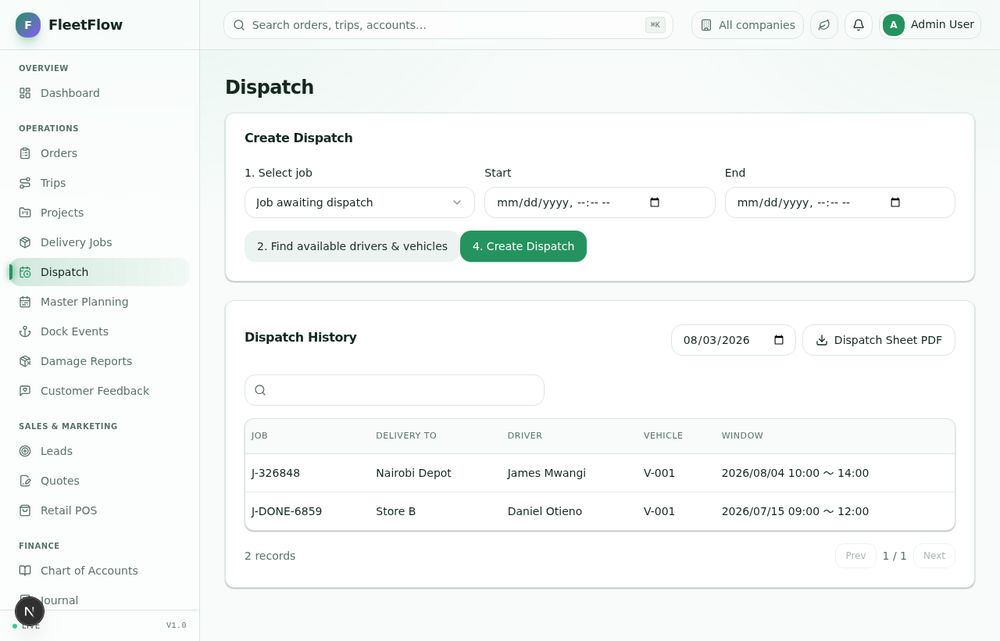

<sub>Screen: **Operations ▸ Dispatch**</sub>

### GPS Waypoints  <sub>`M30`</sub>

**What it does.** A registry of named map points — checkpoints, borders, weighbridges — along the corridors.

**What was implemented**

- Waypoint registry with coordinates, type and country

**How to verify**

1. Open **GPS Waypoints**.
2. Add a checkpoint / border / weighbridge with coordinates.
3. Confirm it is saved to the registry.

> ⚠️ **Expected gap:** Live GPS tracking against these points is not connected yet.

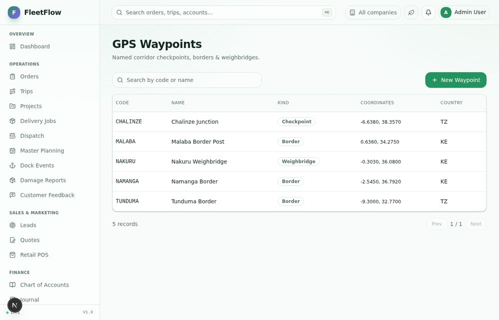

<sub>Screen: **Fleet & People ▸ GPS Waypoints**</sub>

### Units of Measure & Converter  <sub>`M30`</sub>

**What it does.** The catalog of units the business trades in (kg, tonne, litre, km…) with a built-in converter.

**What was implemented**

- A per-company unit catalog across weight / volume / distance / count, each with a factor to its base unit
- A live quantity converter; converting between unrelated units is refused
- Nine common units are supplied out of the box

**How to verify**

1. Open **Units of Measure**.
2. Use the converter, e.g. **5 TON → KG**.
3. Confirm sensible conversions work and mismatched ones (e.g. KG → L) are refused.

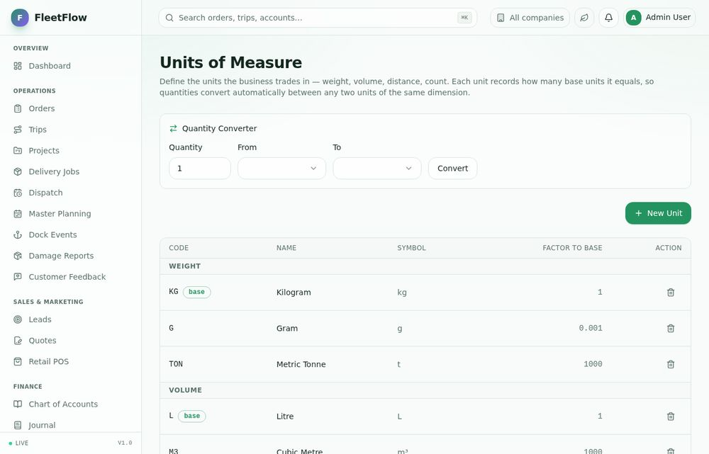

<sub>Screen: **Fleet & People ▸ Units of Measure**</sub>

---

## Phase 4 — Inventory & Payroll

_Stock, warehousing and buying — all with automatic average costing — plus running statutory payroll and staff expense claims._

### Inventory  <sub>`M14`</sub>

**What it does.** Track spare parts, fuel, tyres and other stock, with the cost averaged automatically as you buy.

**What was implemented**

- Stock items with receipts, issues and adjustments — each recorded in the ledger
- Moving-average cost that updates on every receipt

**How to verify**

1. Create a stock item.
2. Record a receipt, then issue some stock.
3. Confirm the average cost updates and the issue posts to the ledger.

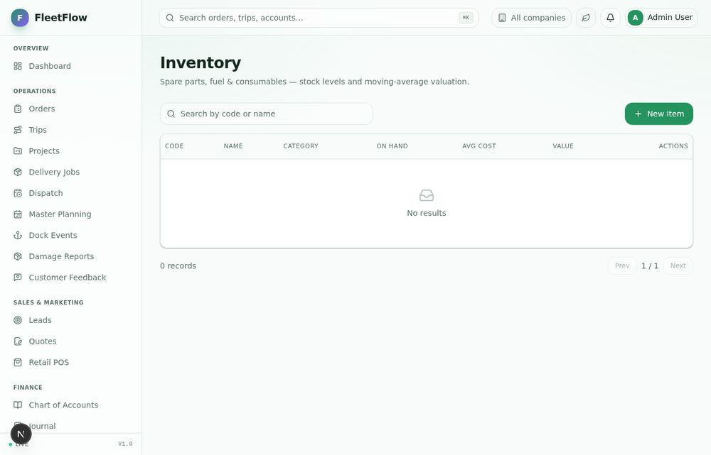

<sub>Screen: **Fleet & People ▸ Inventory**</sub>

### Product Attributes  <sub>`M16`</sub>

**What it does.** Define custom specifications for stock items (e.g. viscosity, thread size) beyond the standard fields.

**What was implemented**

- An attribute catalog (Text / Number / Yes-No / List, optional unit, per category or all)
- Set a value per item from the item's Specs editor

**How to verify**

1. Define an attribute (e.g. viscosity).
2. Set its value on a stock item.
3. Confirm the specification is saved for that item.

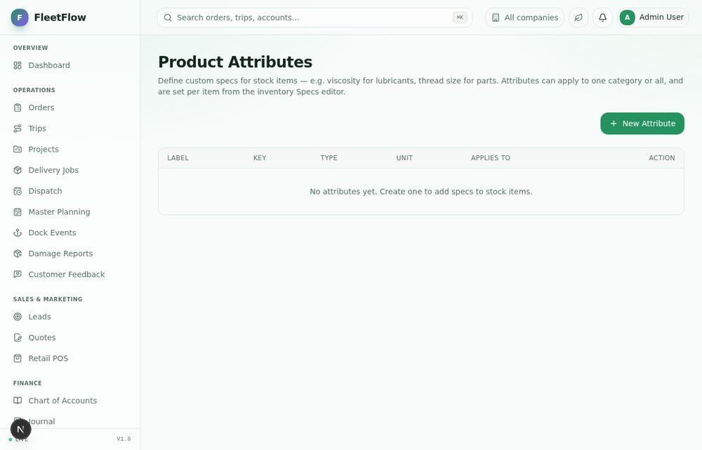

<sub>Screen: **Fleet & People ▸ Product Attributes**</sub>

### Cost Variance  <sub>`M13`</sub>

**What it does.** Compare each item's actual cost to a target (standard) cost to spot overspend.

**What was implemented**

- A standard cost per item versus the live average cost
- Shows per-unit and on-hand value variance, plus purchase-price variance from receipts

**How to verify**

1. Set a standard cost on an item.
2. Open the **Cost Variance** report.
3. Confirm it shows actual versus standard.

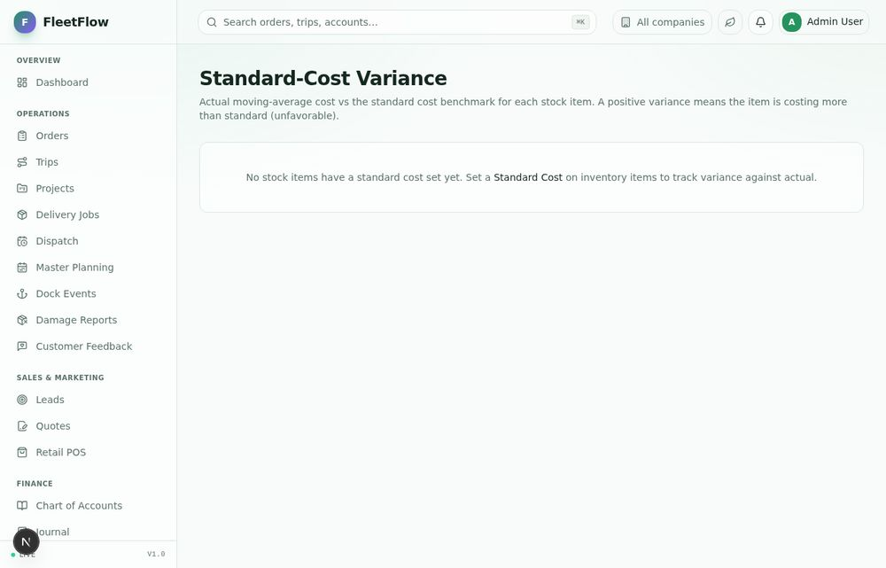

<sub>Screen: **Fleet & People ▸ Cost Variance**</sub>

### Warehouses  <sub>`M18`</sub>

**What it does.** Track stock across multiple locations and move it between them.

**What was implemented**

- Per-location stock balances with a default warehouse
- Transfers between warehouses (out and in)

**How to verify**

1. Add a warehouse.
2. Transfer stock between two warehouses.
3. Confirm the per-location balances and the transfer record.

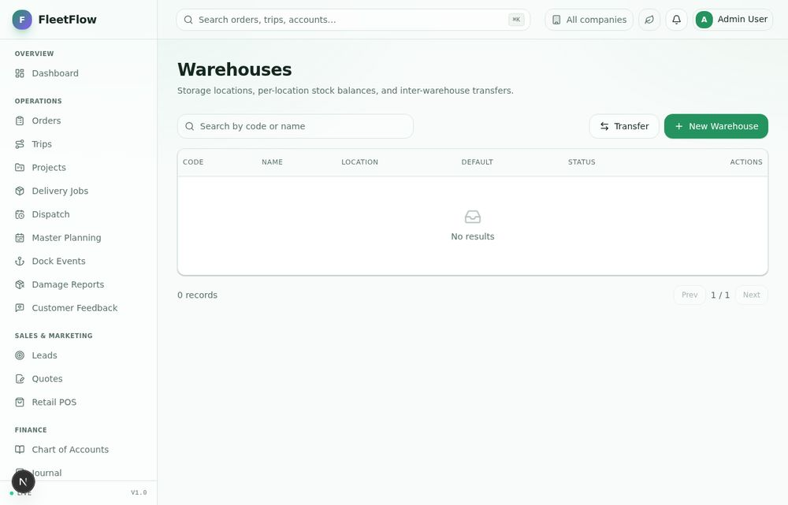

<sub>Screen: **Fleet & People ▸ Warehouses**</sub>

### Procurement  <sub>`M15`</sub>

**What it does.** Purchase orders, receiving the goods, and matching them to the supplier's invoice.

**What was implemented**

- Purchase-order lifecycle: Draft → Approved → Partial → Received → Closed
- Goods receipts and a three-way order↔receipt↔invoice match that flags differences

**How to verify**

1. Raise a purchase order → approve → receive the goods → match the invoice.
2. Confirm the lifecycle advances.
3. Confirm the three-way match flags any variance.

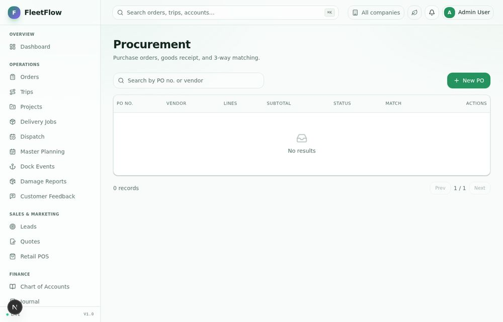

<sub>Screen: **Fleet & People ▸ Procurement**</sub>

### Payroll  <sub>`M9`</sub>

**What it does.** Run monthly payroll with the correct statutory deductions for each country.

**What was implemented**

- Pay runs: Draft → Approved → Posted
- Statutory calculation (PAYE bands, NSSF, SHIF) and ledger posting
- Approved overtime is added to gross pay

**How to verify**

1. Create a monthly pay run → approve → post.
2. Confirm the statutory deductions are calculated.
3. Confirm the run posts to the ledger.

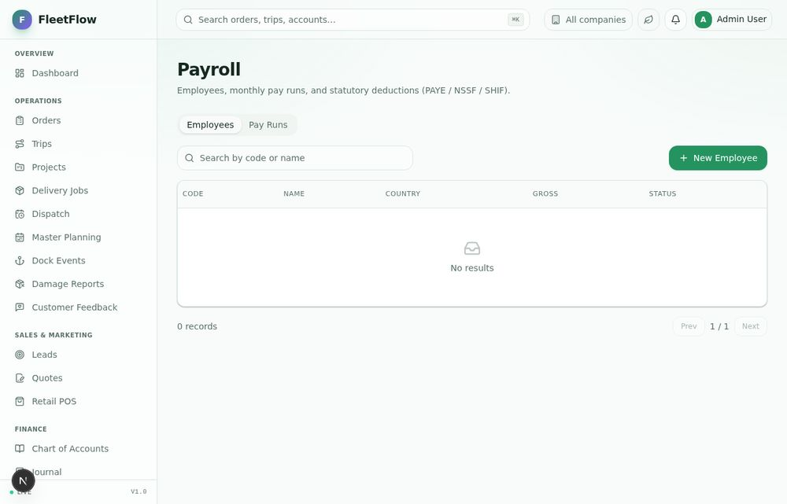

<sub>Screen: **Finance ▸ Payroll**</sub>

### Expense Claims  <sub>`M23`</sub>

**What it does.** Staff and driver expense claims with receipts, approvals, and reconciliation against cash advances.

**What was implemented**

- Claims: Draft → Submitted → Approved → Posted, with a receipt per line
- Reconciled against driver advances and posted to the ledger

**How to verify**

1. File a claim with receipts → submit → approve → post.
2. Confirm it reconciles against the advance.
3. Confirm it posts to the ledger.

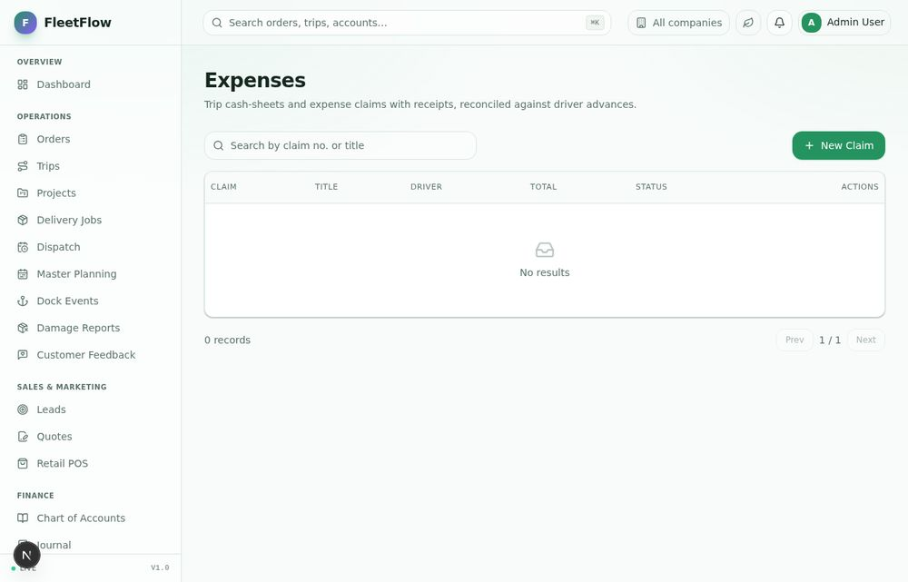

<sub>Screen: **Finance ▸ Expenses**</sub>

---

## Phase 5 — Assets & HR

_The lifecycle of owned assets and the workshop that maintains them, plus the human side: contracts, leave and attendance._

### Fixed Assets — Depreciation, Custody & Warranty  <sub>`M20 · M19`</sub>

**What it does.** The register of owned assets (vehicles, equipment), how they lose value over time, who is holding them, and their warranty status.

**What was implemented**

- Asset register with straight-line depreciation runs that post to the ledger
- Disposal that books the gain or loss
- **Custody**: assign an asset to a person or site — one holder at a time — with full history
- **Warranty** schedule with Current / Expiring-soon / Expired badges (30-day window)

**How to verify**

1. Register an asset; run depreciation; dispose of one.
2. Assign custody to a person, then return it.
3. Set a warranty date and confirm the badge and the assignment history.

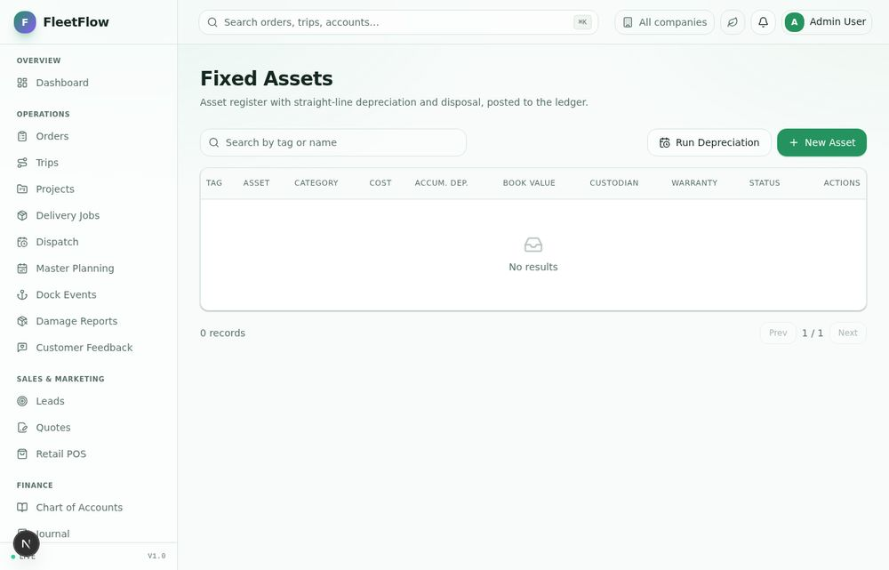

<sub>Screen: **Finance ▸ Fixed Assets**</sub>

### Service Management (Workshop)  <sub>`M22`</sub>

**What it does.** Workshop repair orders — the parts and labor used to service a vehicle.

**What was implemented**

- Service orders: Open → In Progress → Completed → Posted
- Parts issued from Inventory; labor lines
- External-garage labor posts to the ledger; internal labor is a memo cost

**How to verify**

1. Open a service order and issue parts from inventory.
2. Add labor, then complete → post.
3. Confirm the parts reduce inventory and external labor posts.

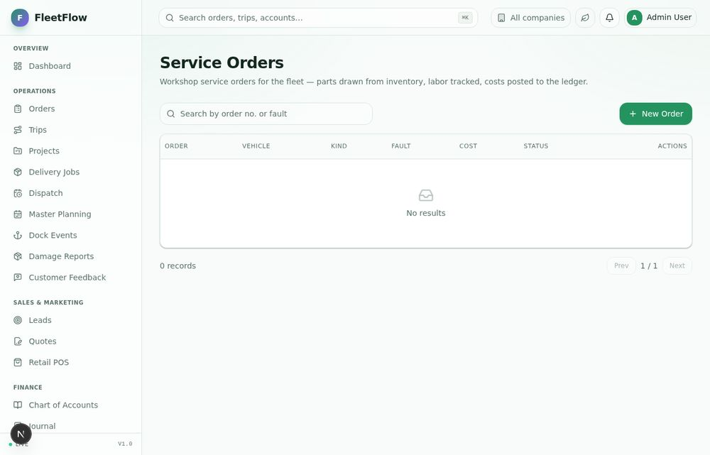

<sub>Screen: **Fleet & People ▸ Service Orders**</sub>

### Human Resources  <sub>`M24`</sub>

**What it does.** Employment contracts, leave, and employee documents.

**What was implemented**

- Contracts (one active per employee; salary syncs on activation)
- Leave management with working-day counts, yearly balances, and approve / cancel with refund
- Employee documents with 14-day expiry warnings

**How to verify**

1. Create an employment contract.
2. Request and approve leave.
3. Add an employee document and confirm the balance change and expiry warning.

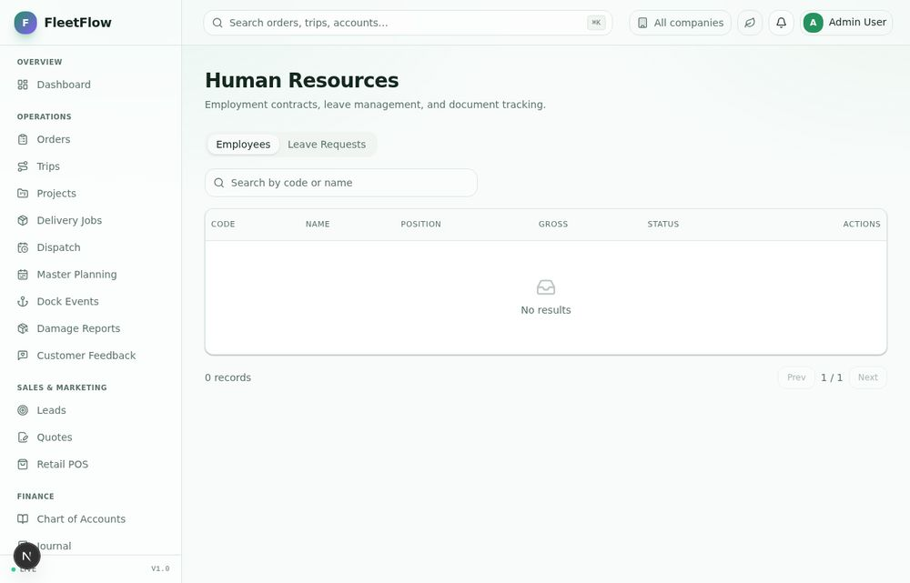

<sub>Screen: **Fleet & People ▸ Human Resources**</sub>

### Time & Attendance  <sub>`M26`</sub>

**What it does.** Clock-in / clock-out records rolled into monthly timesheets, feeding overtime into payroll.

**What was implemented**

- Time entries rolled into monthly timesheets (regular vs overtime past 176h/month)
- Approved overtime flows into Payroll's gross pay

**How to verify**

1. Record clock-in / clock-out entries.
2. Build a monthly timesheet and approve overtime.
3. Confirm the overtime carries into payroll.

> ⚠️ **Expected gap:** Automatic clock-in from biometric terminals is not connected — manual entry works.

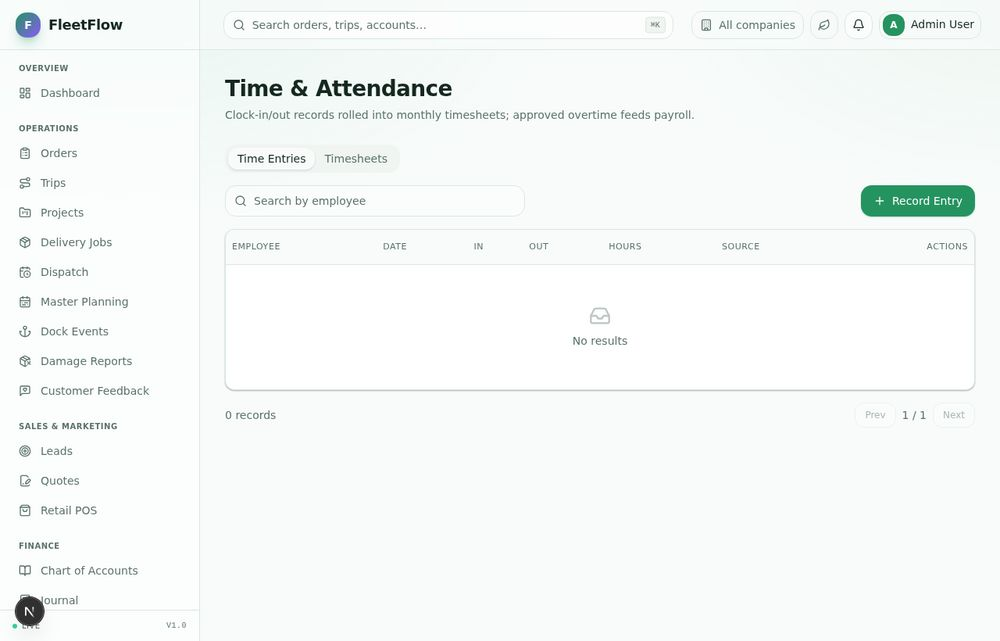

<sub>Screen: **Fleet & People ▸ Time & Attendance**</sub>

---

## Phase 6 — Commercial & Dashboard

_The revenue-facing side — winning and quoting work, counter sales, projects and costing — plus the analytics dashboard and a safe practice sandbox._

### CRM — Sales Leads  <sub>`M27`</sub>

**What it does.** Track sales prospects through a pipeline from first contact to won or lost.

**What was implemented**

- Leads move New → Contacted → Qualified → Won / Lost

**How to verify**

1. Create a lead.
2. Move it through the stages.
3. Confirm the pipeline reflects the change.

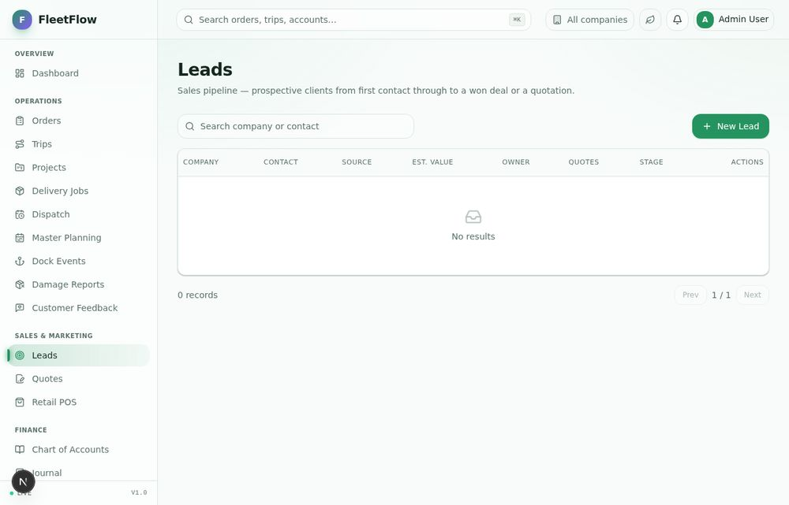

<sub>Screen: **Sales & Marketing ▸ Leads**</sub>

### Freight Quotations  <sub>`M27`</sub>

**What it does.** Price freight quotes and turn an accepted one into a live order automatically.

**What was implemented**

- Quotations with priced line items
- Accepting a quote converts it — in one step — into a freight order carrying the quoted revenue

**How to verify**

1. Raise a quote with line items.
2. Accept it.
3. Confirm it becomes an order with the quoted amount as freight revenue.

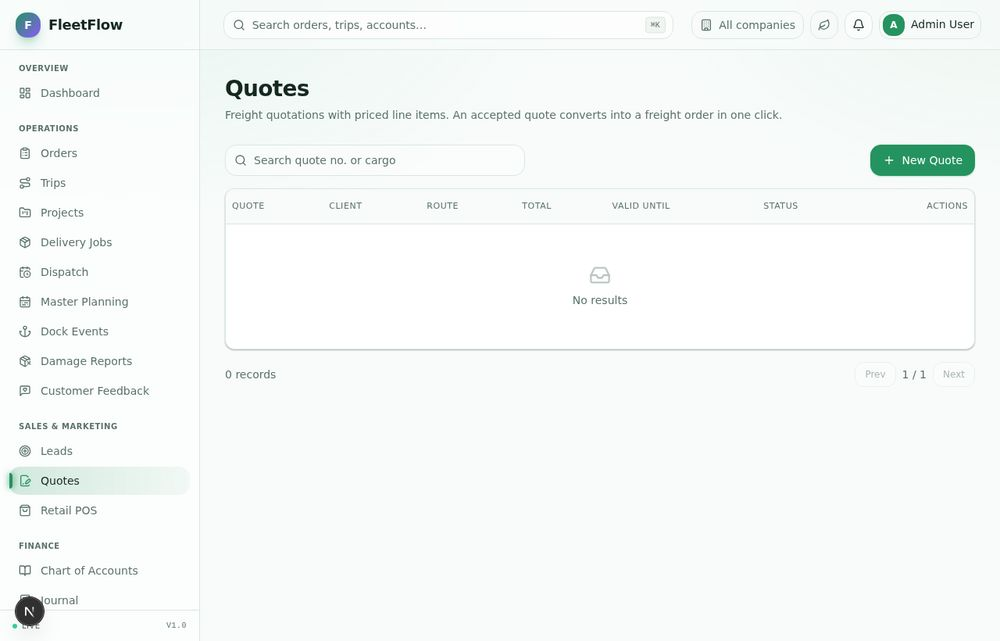

<sub>Screen: **Sales & Marketing ▸ Quotes**</sub>

### Retail POS  <sub>`M28`</sub>

**What it does.** Over-the-counter sales of stock items, with inventory and accounting handled automatically.

**What was implemented**

- Completing a sale reduces inventory at average cost
- Posts Cash / Revenue and Cost-of-Goods / Inventory; selling more than you hold is blocked; a void puts stock back

**How to verify**

1. Ring up a counter sale and complete it.
2. Void a sale.
3. Confirm inventory and accounting update, and that overselling is blocked.

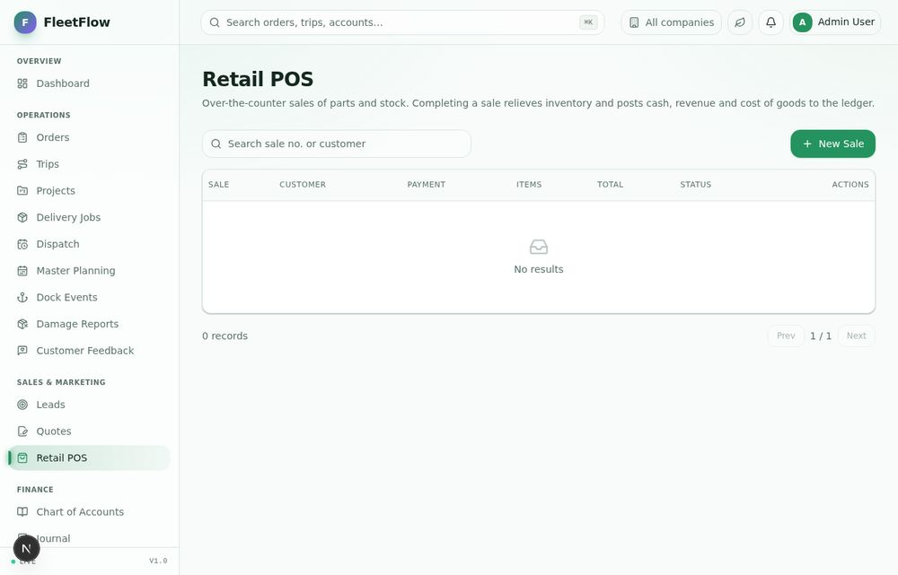

<sub>Screen: **Sales & Marketing ▸ Retail POS**</sub>

### Project Management  <sub>`M29`</sub>

**What it does.** Group freight orders into a project or contract and track budget against actual.

**What was implemented**

- Projects group orders against a planned budget
- A live budget-vs-actual profit view that rolls up revenue and cost from the linked orders

**How to verify**

1. Create a project and attach freight orders.
2. Set a planned budget.
3. Confirm the live profit rolls up from the orders.

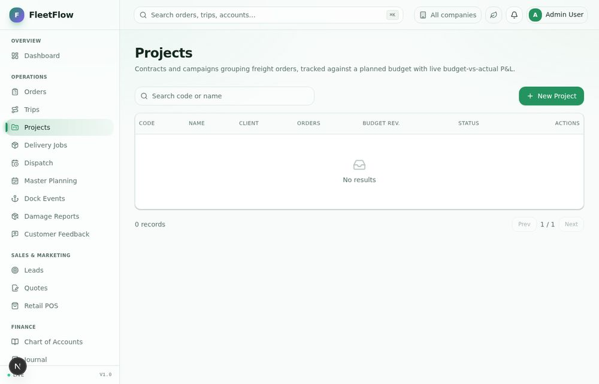

<sub>Screen: **Operations ▸ Projects**</sub>

### Corridor Profitability  <sub>`M6`</sub>

**What it does.** Profit and loss broken down by trade corridor, built from each trip's figures.

**What was implemented**

- Per-corridor profitability, tied back to per-trip P&L and fuel efficiency

**How to verify**

1. Open **Corridor P&L**.
2. Confirm profitability is shown per corridor.
3. Cross-check a figure against a trip's P&L.

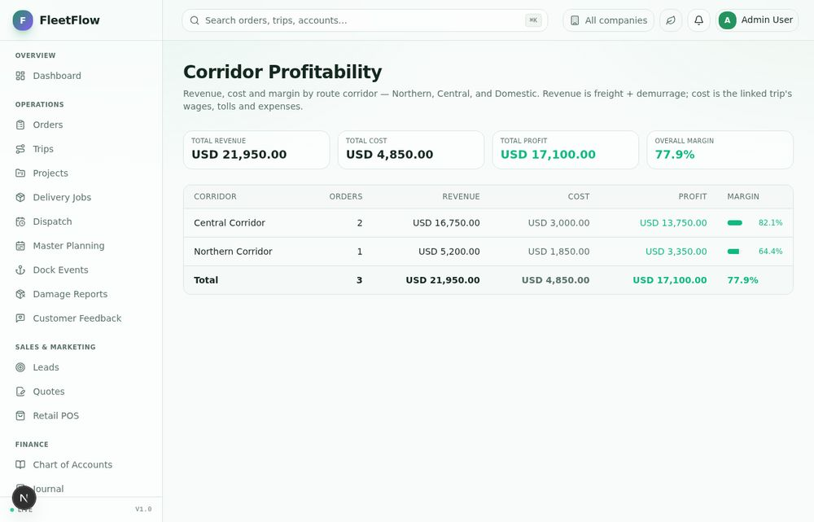

<sub>Screen: **Finance ▸ Corridor P&L**</sub>

### Master Planning  <sub>`M33`</sub>

**What it does.** Forecast demand per corridor and compare it to the fleet capacity you actually have.

**What was implemented**

- Demand forecasts per period and corridor (loads & tonnage)
- A capacity plan comparing confirmed demand to available fleet (excluding trucks in maintenance), with shortfall / surplus

**How to verify**

1. Enter a demand forecast for a period + corridor.
2. Open the capacity plan.
3. Confirm the shortfall / surplus and utilization per corridor.

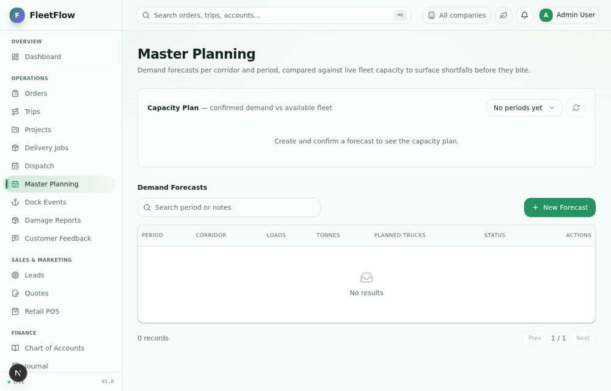

<sub>Screen: **Operations ▸ Master Planning**</sub>

### KPI Dashboard  <sub>`KPI`</sub>

**What it does.** The at-a-glance operations dashboard with the key performance indicators.

**What was implemented**

- Headline cards: jobs today, delivering, completed, active drivers, available vehicles, revenue
- A monthly revenue & jobs summary
- A wider KPI set computed behind the scenes: on-time delivery, transit time, cost/km, revenue/km, utilization, fuel efficiency, AR recovery, and customer CSAT / NPS

**How to verify**

1. Open **Overview ▸ Dashboard**.
2. Confirm the KPI cards and the monthly summary render.
3. Scroll to review the wider KPI set.

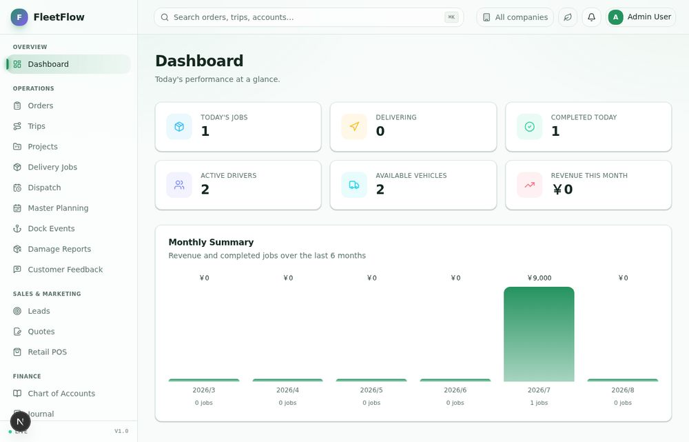

<sub>Screen: **Overview ▸ Dashboard**</sub>

### KPI Capture — Dock, Damage & Feedback  <sub>`KPI`</sub>

**What it does.** Capture the day-to-day events that feed the harder KPIs — how fast trucks turn around, damage & claims, and how happy customers are.

**What was implemented**

- **Dock Events** (arrival / departure → truck turnaround)
- **Damage Reports** (with a status lifecycle → damage & claim rate)
- **Customer Feedback** (satisfaction 1–5 and recommend-score 0–10)

**How to verify**

1. Log a dock arrival / departure.
2. File a damage report and a customer feedback entry.
3. Confirm these feed Truck Turnaround, Damage & Claim Rate and CSAT / NPS on the dashboard.

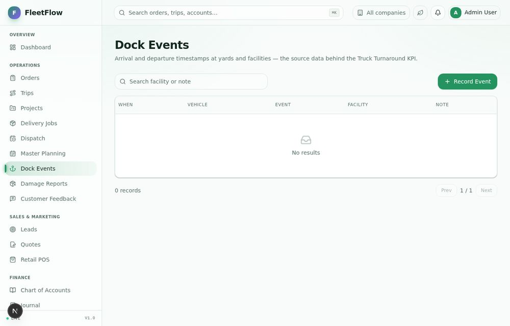

<sub>Screen: **Operations ▸ Dock Events · Damage Reports · Customer Feedback**</sub>

### Demo Sandbox  <sub>`M32`</sub>

**What it does.** A throwaway practice company you can fill with demo data and reset any time — safely walled off from real data.

**What was implemented**

- Isolated sandbox companies you can provision on demand
- Reset restores a clean demo baseline; reset **refuses** any real (non-sandbox) company
- A sandbox badge on the company switcher so it's obvious where you are

**How to verify**

1. Provision a sandbox company.
2. Reset it and watch the demo data return.
3. Try to reset a **real** company — confirm the system refuses.

> ✅ **Expected:** You can experiment freely and reset, with no way to wipe real data.

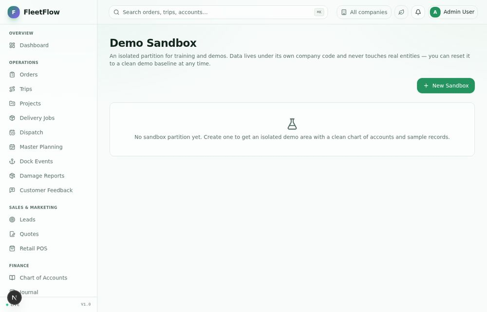

<sub>Screen: **System ▸ Demo Sandbox**</sub>

---

## Cross-cutting controls

_Security and data-integrity guarantees that span every module._

### Separation of duties  <sub>`Security`</sub>

**What it does.** Accounting authority and operations editing are kept apart.

**How to verify**

1. Sign in as **Dispatcher** and try to post a journal — blocked.
2. Sign in as **Finance** and try to open User management — blocked.
3. Confirm only **Admin** can manage users and roles.

### Company data isolation  <sub>`§6.2`</sub>

**What it does.** Every query is partitioned by company at the data layer.

**How to verify**

1. As a non-admin in one company, try to open a record from another company.
2. Confirm it is **not found** (the data is walled off).

### Optimistic concurrency  <sub>`§7.1`</sub>

**What it does.** Two people editing the same record can't silently overwrite each other.

**How to verify**

1. Open the same record in two tabs.
2. Save an edit in the first tab.
3. Save in the second — confirm the stale save is rejected.

---

## Expected gaps — not defects

The following features connect to third-party services and are **waiting on client-provided sandbox credentials**. The data models are in place to receive them, but no live client is wired up yet — please do **not** log these as bugs during testing:

- **E-invoicing** — KRA TIMS (Kenya) & TRA VFD (Tanzania)
- **Mobile money** — M-Pesa & Airtel Money disbursements
- **Bank feeds** — CRDB / KCB / Stanbic statement import
- **Live GPS telematics** — real-time positions & idle time (the waypoint registry itself works)
- **Biometric terminals** — automatic clock-in ingestion (manual time entry works)

Three modules are intentionally **out of scope** for this logistics build and have no screen: Vendor Collaboration portal (M17), Production Control (M21), and Questionnaire (M25).

---

_33 of 36 contracted modules delivered across 6 phases (the remaining 3 are out of logistics scope). Screenshots captured from a live, seeded instance._
